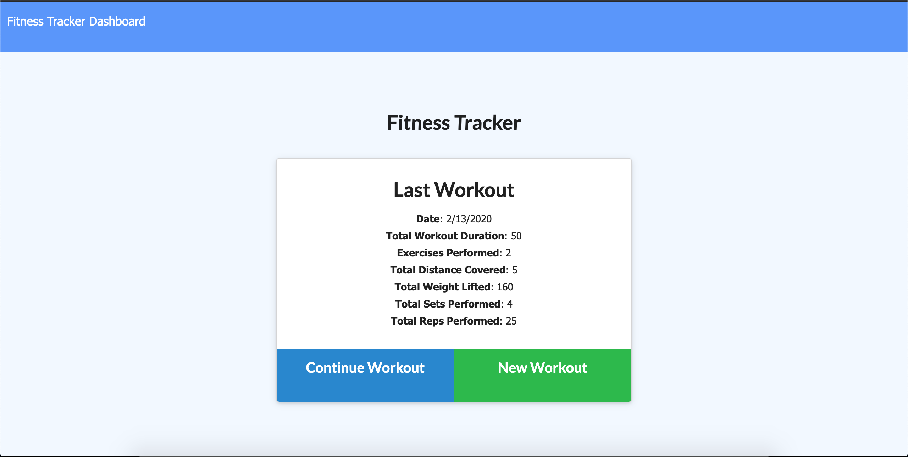

# Fitness-Tracker
MongoDB Fitness Tracker

The purpose of this project was to build an application that would allow users to save, update, and view data from their workouts. The project user story is below.

```
AS A habitual exerciser

I WANT to be able to view, create, and update my workouts (including number of sets, reps, amount of weight,duration, and multiple exercises per workout) 

SO THAT I can manage my metrics and plan workouts more efficiently.
```

 The criteria for a successful project are below: 

* Application should allow users to add exercises to a previous workout.

* Application should allow users to add new exercises to a new workout. 

* Application should allow users to view combined workout data on a separate "stats" page. 

## Getting Started

The deployed project should look like this.




Below is the link to the project repository and a link to the deployed application on Heroku.

https://github.com/jcw2865/Fitness-Tracker

https://stark-savannah-91252.herokuapp.com/

### Development

Below are the steps I took to create the application as it is so far. The most difficult aspects of this application for me were understanding the new syntax for Mongoose and MongoDB, and understanding how to get the charts on the Stats page to work. 

1. Created and linked the initial files (JS files, HTML files, JSON files). 

2. Downloaded all dependecies using npm. 

3. Created and verified all HTML routes.

4. Created and tested API routes with Postman and Robo3T. 

5. Created functions to render API route data onto pages.

6. Troubleshoot the returned data object from API routes to get the desired output.

7. Troubleshoot the charts to represent the real data being entered. 

8. Troubleshoot the deployment to Heroku. I initially tried to deploy without the use of MLab, which failed. I also had issues with my pathways which had to be fixed in order for the site to work correctly. 

## Testing

This application was not developed using Test Driven Development. However, at numerous points throughout development, Postman and console.log's were used to test the results of new elements. 

## Deployment

This program can be viewed and deployed using most internet browsers via the links in the "Getting Started" section. 

## Built With

* [VSCode](https://code.visualstudio.com/) - The platform I used for developing this project.
* [MDN](https://developer.mozilla.org/en-US/) - Used as a reference tool.
* [GoogleChrome](https://www.google.com/chrome/) - Used for inspector tool and validating the program during development. 
* [Node.js](https://nodejs.org/en/) - Used to execute JS code outside of a web browser.
* [NodePackageManager](https://www.npmjs.com/) - Used to install node modules/dependencies
* [Postman](https://www.getpostman.com/) - A collaboration platform for API development.
* [MongoDB](https://www.mongodb.com/) - A document-based database system.
* [Mongoose](https://mongoosejs.com/) - MongoDB object modeling for Node.js
* [Robo3T](https://robomongo.org/) - A GUI for MongoDB used in development.
* [mLab](https://mlab.com) - Used to host the MongoDB database.
<!-- ## Contributing

Please read [CONTRIBUTING.md](https://gist.github.com/PurpleBooth/b24679402957c63ec426) for details on our code of conduct, and the process for submitting pull requests to us. -->

## Authors

* **Jake Walker** - [jcw2865](https://github.com/jcw2865)

<!-- See also the list of [contributors](https://github.com/your/project/contributors) who participated in this project. -->

<!-- ## License

This project is licensed under the MIT License - see the [LICENSE.md](LICENSE.md) file for details -->

## Acknowledgments

* The advisors, instructors, and TAs at the Coding Bootcamp at the University of Texas at Austin
* Tutoring staff at Trilogy
* Fellow classmates at the Coding Bootcamp at UT-Austin
* Friends in the industry
